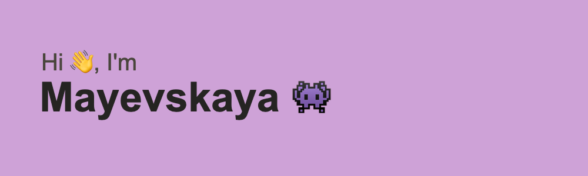

<h4><i>«Why mathematicians don't like basketball? Because they don't understand how is it possible to get into the field, but not into the ring.»</i></h4>

----

|T|H|I|N|`G`|S|I|<|3|
|-|-|-|-|-|-|-|-|-|
|||||`I`|
|`S`|`P`|`O`|`R`|`T`|`P`|`R`|`O`|`G`
|`O`||||||||`R`
|`F`||`B`|`I`|`G`|`D`|`A`|`T`|`A`
|`T`||||||||`H`|
|`D`|`O`|`C`|`K`|`E`|`R`|||`S`
|`E`||`P`||||`M`
|`V`||`P`|`Y`|`T`|`H`|`O`|`N`
|||||||`D`
|`M`|`A`|`T`|`H`|||`E`
||`V`|||||`L`
||`R`|||||`S`

  
TL;DR

  <ul>
    <li>Git
    <li>Docker
    <li>Sport Programming
    <li>Big Data : Big Data and all its deritatives
    <li>Software Development
    <li>Models : Passionate about creating different prediction models, especially based on regression
    <li>Math : Exploring math analysis and high math to understand Machine Learning algorithms better
    <li>CPP+Python : Favorite (most used) langauges
    <li>AVR micocontrollers : Woking with Arduino boards is my hobby
  </ul>

 

----

&nbsp;&nbsp;

