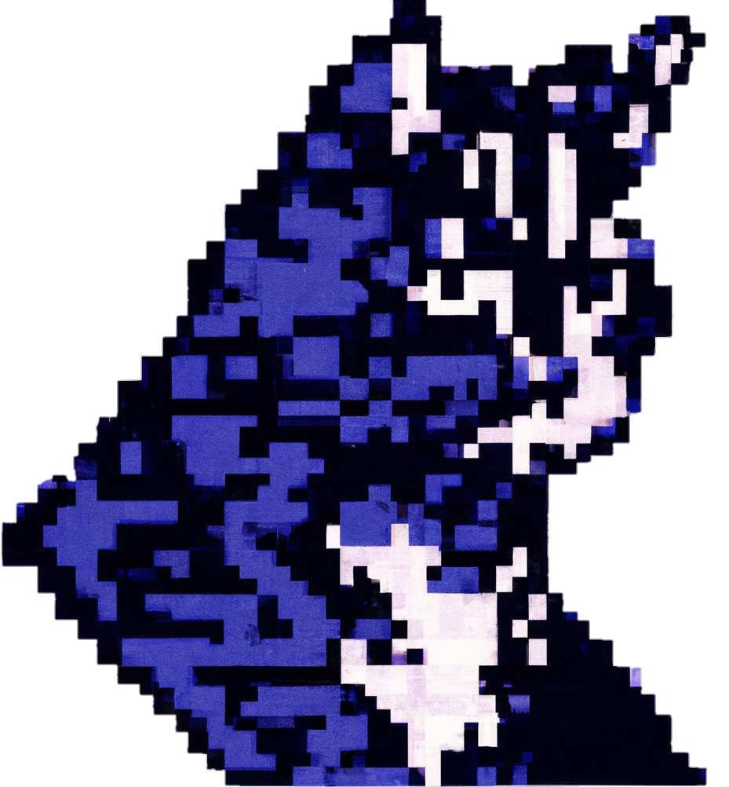

<h3><i>«Why mathematicians don't like basketball? Because they don't understand how is it possible to get into the field, but not into the ring.»</i></h3>

 

<h2 style="padding-left:2%;line-height:1.2em;">C Y B E R C A T : 
„ Meow there, traveler! I'm a cybercat, the chick's who owns this Github account beloved pet. So, about me... Wait, I don't need that, everybody loves me. Righty, my owner's name is Alice. She does lotta IT things, like Data Science, Software Development, I'm not going to name all of it, she'll do it herself. I just hope you have some interesting work for her, she's a real hard worker. Is that smell of Cybenibble? Shoot, I gotta go, cya!“
</h2>

<table style="margin-top:2px;">
<!-- 1 -->
<tr>
<th style="border-bottom:none">
<th style="border-bottom:none">
<th style="border-bottom:none">
<th style="border-bottom:none">
<th style="border-bottom:none">
<th style="border-bottom:none">
<th style="border-bottom:none">
<th style="border-bottom:none">
<th style="border-bottom:none">
<th style="border-bottom:none">
<th style="border-bottom:none">
<th style="border: solid gray 1px">P
<th style="border-bottom:none">
<!-- 2 -->
<tr>
<td style="border-top:none;">
<td>
<td>
<td>
<td>
<td>
<td>
<td>
<td>
<td>
<td>
<td style="border: solid gray 1px">A
<!-- 3 -->
<tr>
<td>
<td style="border: solid gray 1px">T
<td style="border: solid gray 1px">H
<td style="border: solid gray 1px">I
<td style="border: solid gray 1px">N
<td style="border: solid gray 1px">G
<td style="border: solid gray 2px">S
<td style="border: solid gray 1px">I
<td style="border: solid gray 2px">D
<td style="border: solid gray 1px">O
<td>
<td style="border: solid gray 1px">R
<td>
</table>

  
TL;DR

  <ul>
    <li><a href="#">Option 1</a></li>
    <li><a href="#">Option 2</a></li>
    <li><a href="#">Option 3</a></li>
  </ul>

