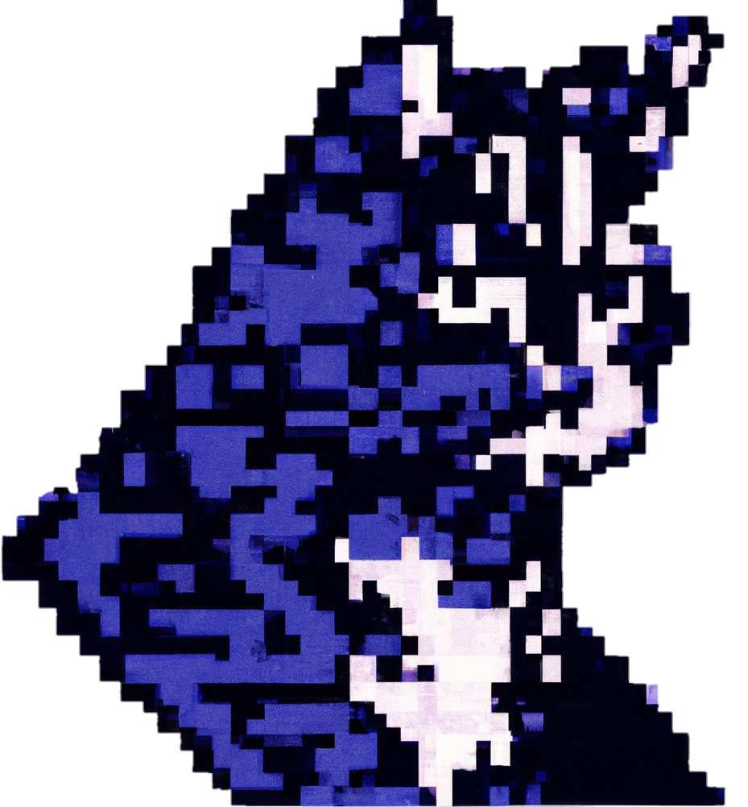

<h4><i>«Why mathematicians don't like basketball? Because they don't understand how is it possible to get into the field, but not into the ring.»</i></h4>

----

&nbsp;&nbsp;

| | | | | | | | | | |T|H|I|N|`G`|S|I|`D`|O| |
|-|-|-|-|-|-|-|-|-|-|-|-|-|-|-|-|-|-|-|-|
| | | | | | | | | | | | | | |I| | |A| | |
| | | | | | | | | | | | | | |T| | |T| | |
| | | | | | | | |Q̷| | | | | | | |M|`A`|T|H|
| | | | | | | | |L| | | |P| | | | |S| | |
| | | | | | | | |E| |D| |A| | | | |`C`|P|`P`|
| | | |G| |S| | |A| |O| |R| | | | |I| |Y|
| |P| |R| |O| | |R| |C| |S| |M| | | | |T|
|`+`|R| |A| |F| | |N| |K| |I| |O| | | | |H|
|C|`O`|M|`P`|E|`T`|I|T|`I`|V|`E`| |N| |D| |A| | |O|
| |G| |H| |W| | |N| |`R`|E|`G`|R|`E`|S|`S`|I|O|`N`|
| | | | | |A| | |G| | | | |`+`|L| |Y| | | |
| | | | |`+`|R| | | | | | | | | | |N| | | |
| | | | |D|`E`|V| | | |R|O|B|O|T|I|`C`|S| | |

  
TL;DR

  <ul>
    <li>Git : Work with Git
    <li>Data Science : Enthusiasm in Data Science
    <li>Math : Exploring Math Analysis and High Math for Data Science
    <li>CPP+Python : Most used Programming Langs
    <li>Regression+Model : Prediction models based on regression models discovered
    <li>Async : Experienced in working with concurrency programming
    <li>Parsing : Familiar with parsing tools on CPP+Python
    <li>Docker : Can containerize apps
    <li>(Q-)Learning : Never stop learning something new (Q-Learning algorithm in progress)
    <li>Software+Dev : Able to create simple microservice / app
    <li>Graph : Have graphs knowledge
    <li>Competitive+Prog : Practicing for international competitions (like ICPC)
  </ul>

----

 

 

