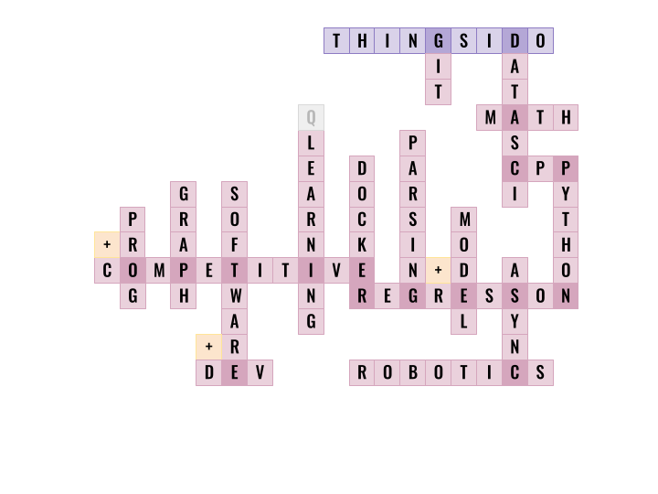

<h3><i>«Why mathematicians don't like basketball? Because they don't understand how is it possible to get into the field, but not into the ring.»</i></h3>

----

  
TL;DR

  <ul>
    <li>Git : Work with Git
    <li>Data Science : Enthusiasm in Data Science
    <li>Math : Exploring Math Analysis and High Math for Data Science
    <li>CPP+Python : Most used Programming Langs
    <li>Regression+Model : Prediction models based on regression models discovered
    <li>Async : Experienced in working with concurrency programming
    <li>Parsing : Familiar with parsing tools on CPP+Python
    <li>Docker : Can containerize an app
    <li>(Q-)Learning : Never stop learning something new (Q-Learning algorithm in progress)
    <li>Software+Dev : Able to create simple microservice / app
    <li>Graph : Have graphs knowledge
    <li>Competitive+Prog : Practicing for international competitions (like ICPC)
  </ul>

----

&nbsp;&nbsp;
&nbsp;&nbsp;
&nbsp;&nbsp;

&nbsp;&nbsp;
&nbsp;&nbsp;
&nbsp;&nbsp;

